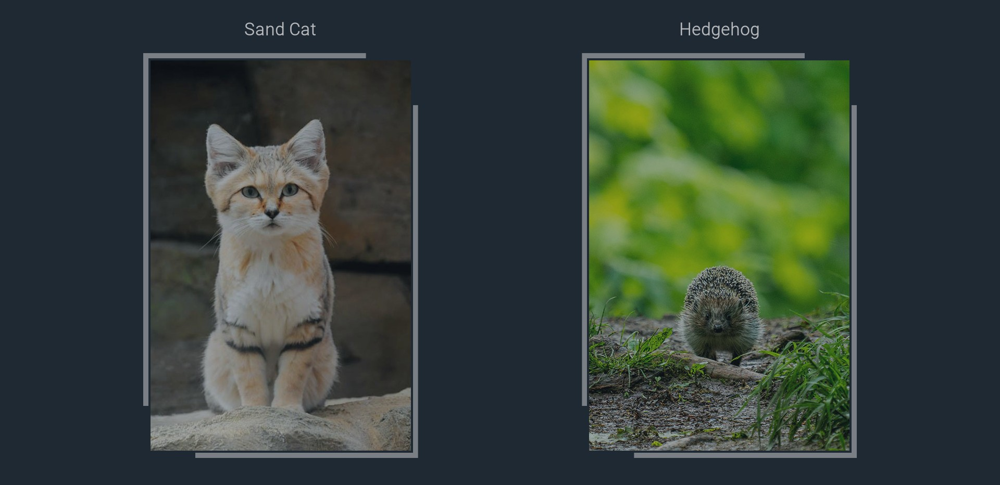

# Instant Serotonin

This is the source code for a simple web app that scrapes the internet for cute
animal pictures, and displays one at random upon user request.
It is mainly written in Python, utilising the Flask web framework.
The frontend component is a standard HTML-CCS-JS website, with a simple custom styling.

## Functionality

A scheduled script (collect_script.py) gathers data from pre-set sources every night,
and stores the information in pickle files (./data/). The raw data is then read when Flask
assembles the requested HTML page, and a random post is selected.

Currently scraped sources: Pixabay, Pexels, Unsplash, and thematic subreddits.

The reddit scraping function uses the [PRAW module by Bryce Boe](https://github.com/praw-dev/praw).
Server-side Flask sessions are utilised (via the [Flask-Session extension]( https://github.com/pallets-eco/flask-session))
to avoid sending the same results to the same user multiple times.

The HTML-CSS side has a responsive, Flexbox layout. It is optimized to display correctly on all screen types.

## Screenshots

  
  
  
  

## Other

The currently running version is accessible: **[here](https://www.serotonin.fun/)**.

Sources of the static images used in this project: **[image_sources.md](image_sources.md)**.

Font utilized: [Roboto Light designed by Christian Robertson](https://fonts.google.com/specimen/Roboto).

**[Contact](mailto:lcs_it@proton.me)**

