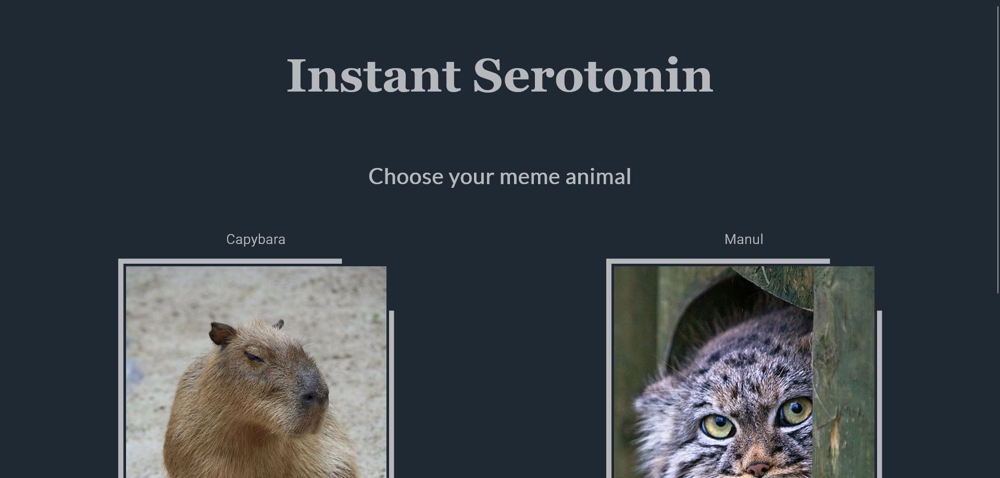
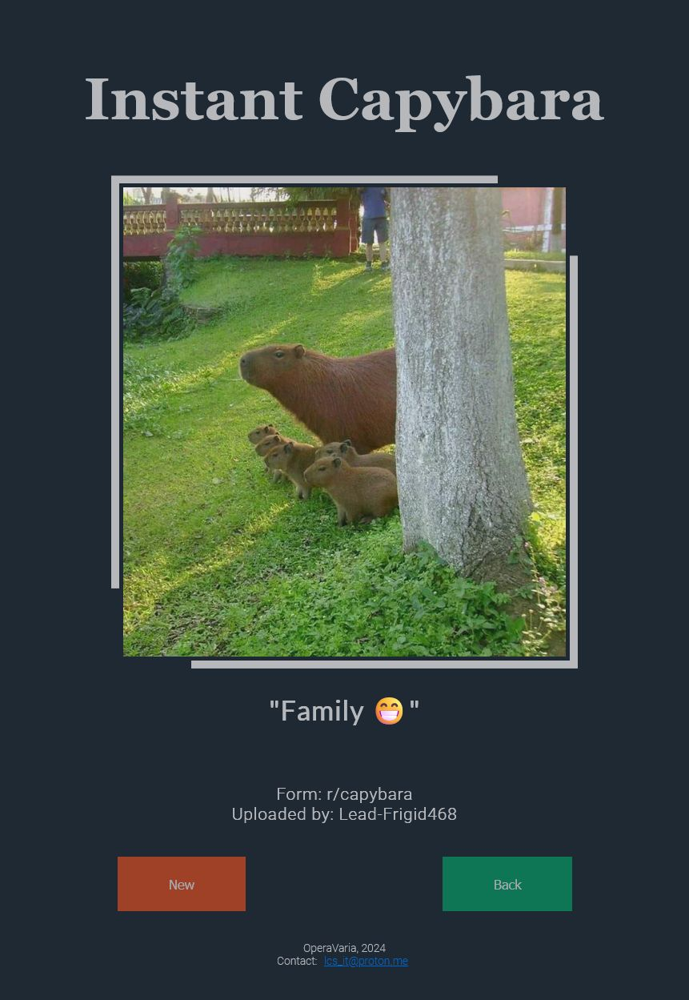
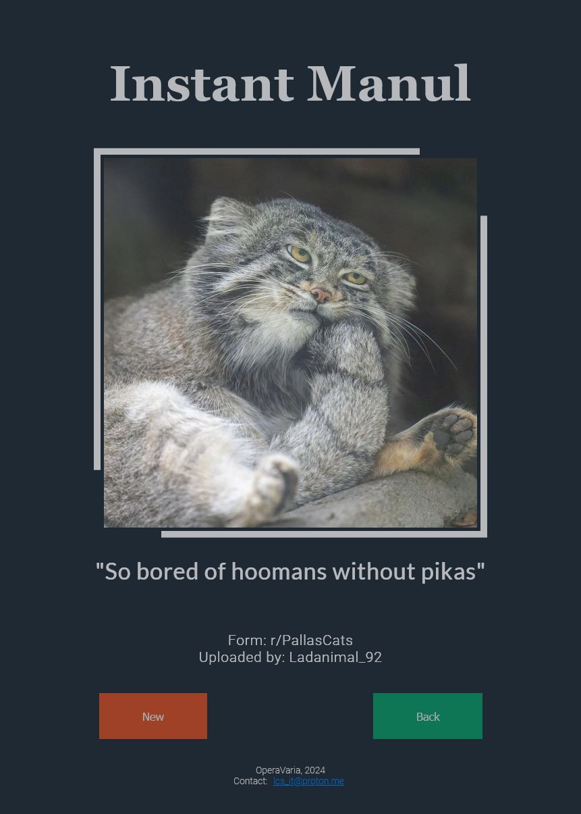

# Instant Serotonin

This is the source code for a simple webapp that scrapes the internet for meme
animal (currently capybara and manul) pictures, and displays one at random when the user accesses the webpage. The app is mainly written in Python, utilising the Flask web framework.

## Functionality

The webapp is set up to be hosted at [pythonanywhere.com](https://www.pythonanywhere.com/).
Scheduled background tasks (found in the "scraping" directory) collect the top 30 posts in
the "hot" category from subreddits every day, and store the information in pickle files
("data" directory). The raw data is then read when Flask assembles the requested HTML page,
and a random post is selected.

The HTML-CSS side utilises the Flexbox layout; is is optimized to display correctly on all
screen types.

## Screenshots

## Other

The currently running version is accessible: **[here](https://serotonin-operavaria.eu.pythonanywhere.com/)**.

**[Contact](mailto:lcs_it@proton.me)**

