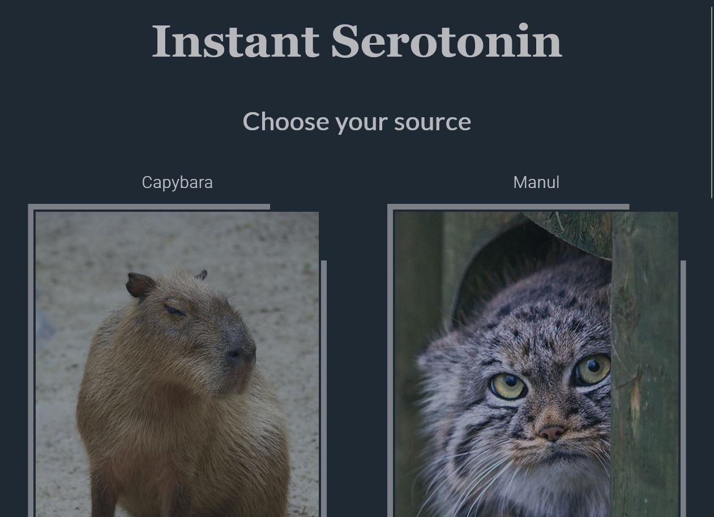

# Instant Serotonin

This is the source code for a simple webapp that scrapes the internet for cute
animal pictures, and displays one at random upon user request.
The app is mainly written in Python, utilising the Flask web framework.
The frontend part is standard HTML-CCS-JS, with a simple custom styling.

## Functionality

The webapp, in its current form, is set up to be hosted at [pythonanywhere.com](https://www.pythonanywhere.com/).
Scheduled background tasks (./scraping/) collect the top 30 posts in
the "hot" category from preset subreddits every night, and then store the information in pickle files
(./data/). The raw data is then read when Flask assembles the requested HTML page, and a random post is selected.

The HTML-CSS side utilises a responsive, Flexbox layout. It is optimized to display correctly on all
screen types.

## Screenshots

## Other

The currently running version is accessible: **[here](https://serotonin-operavaria.eu.pythonanywhere.com/)**.

Sources of the static images used in this project: **[image_sources.md](image_sources.md)**.

**[Contact](mailto:lcs_it@proton.me)**

