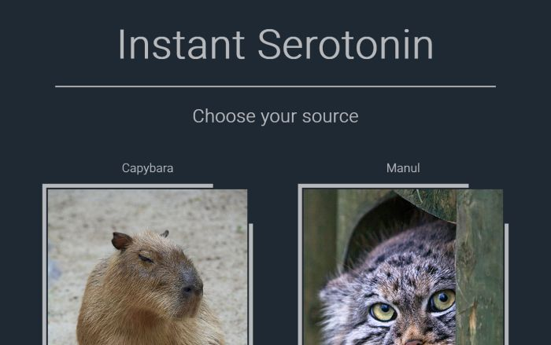
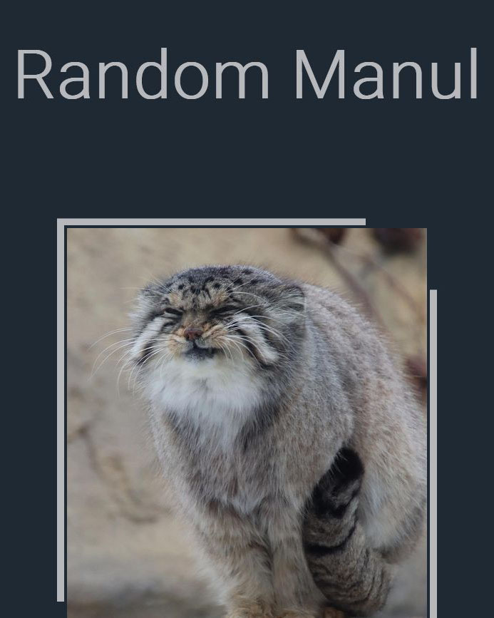
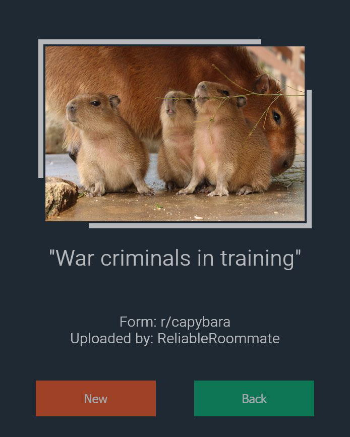

# Instant Serotonin

This is the source code for a simple web app that scrapes the internet for cute
animal pictures, and displays one at random upon user request.
Its mainly written in Python, utilising the Flask web framework.
The frontend component is a standard HTML-CCS-JS website, with a simple custom styling.

## Functionality

The webapp, in its current form, is set up to be hosted at [pythonanywhere.com](https://www.pythonanywhere.com/).
Scheduled background tasks (the scripts in ./scraping/) collect the top 30 "hot" posts from preset subreddits every night,
and store the information in pickle files (./data/). The raw data is then read when Flask assembles the requested HTML page,
and a random post is selected. The scraping scripts use the [PRAW module by Bryce Boe](https://github.com/praw-dev/praw).

Server-side Flask sessions are utilised (via the Flask-Session extension) to avoid sending the same results to the same user.

The HTML-CSS side has a responsive, Flexbox layout. It is optimized to display correctly on all
screen types.

## Screenshots

## Other

The currently running version is accessible: **[here](https://serotonin-operavaria.eu.pythonanywhere.com/)**.

Sources of the static images used in this project: **[image_sources.md](image_sources.md)**.

Font utilized: [Roboto Light designed by Christian Robertson](https://fonts.google.com/specimen/Roboto).

**[Contact](mailto:lcs_it@proton.me)**

